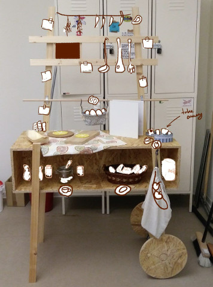
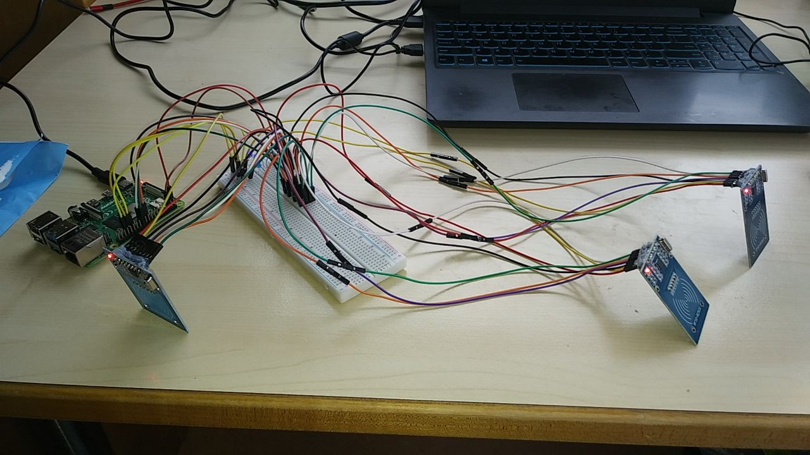

# Happy Day App

Written and used for the [art project "Soup Kitchen. A recipe of one Bright Day"](#artistic-elements) by [@constvigilance]().



## Components

### Hardware

The App runs on the Raspberry PI single-board computer under the Raspberry Pi OS (formerly Raspbian),
powered by a 20000 MAh power bank,
with an [LCD (1024x600 pixels)](web-server/public/images/lcd_testing.jpg)
and 3 [RFID-RC522 sensors](web-server/public/images/rfid-rc522_layout.jpg) connected.<br />
(See the [wiring scheme](web-server/public/images/el_wiring_scheme.jpg).)<br />
The sensors read a few RFID-tags when the later get placed near the former.



### Artistic elements

The hardware is installed on a mobile ["kitchen trolley"](web-server/public/images/kitchen_trolley.jpg), [designed](web-server/public/images/trolley_design2.jpg) and [built](web-server/public/images/kitchen_box_assembly.jpg) for this project, with 3 plates on the "table", which hide RFID sensors beneath them.

The RFID-tags are attached to (hidden in) real-world objects (apples, bread slices, tea bags, etc...).

[Video clips](web-server/public/videos) were authored and [filmed](web-server/public/images/filming3.jpg) according to the [scenario](web-server/public/images/scene_flow.jpg).


### Software

The App consisting from the following software components:

1. RFID-controller
   > _A python application that reads states of a few RFID-readers and whenever the state is changed, via the HTTP-server, it notifies the Browser App on the new state._<br/>
   > This new state is considered to be a user "choice" which the Browser App shall react to.
2. HTTP-Server
   > _A simple web-server that serves files and pushes the "choices" (notifications) from the RFID-controller to the Browser App ._
3. Browser App <br />
   (see [web-server/README.md](web-server/README.md))
   > _A single-page application which requests files from the HTTP-Server, and gets notified by the HTTP-Server on a new "choice"._<br/>
   > The application shows "scenes". Every scene has a video to play and a set of messages for user.<br/>
   > Reacting on "choices", the application shows messages and switches between scenes according to a predefined [scenario](web-server/public/images/scene_flow.jpg).<br/>

## To install

```bash
$ npm install
```

## To run the Application

### Production environment

```sh
# Start all components
$ npm run start
# Stop all components
$ npm run stop
# See the status (if components run)
$ npm run status
# See logs
npm run logs
# Monitor components
$ npm run monitor
```

### Development environment

To start the RFID-controller

```
$ npm run dev:contr
```

To start the HTTP server, run (in another terminal)

```
npm run dev:server
```

To start the Browser App in the Chrome browser

```
$ npm run dev:brows
```

#### Play with it

Start components ([in dev environment](#Development environment)), then open terminal and try...

```
# Simulate user choices (complete scenario)
$ npm run dev:contr:simulate
```

```
# Show "dev" buttons
$ curl http://localhost:3000/publish/choice-msg/x-x-DEV

# Simulate a "choice" message from the RFID-controller
$ curl http://localhost:3000/publish/choice-msg/A-F-x

$ curl http://localhost:3000/publish/navigate-to-page/start
$ curl http://localhost:3000/publish/navigate-to-page/sceneA
$ curl http://localhost:3000/publish/navigate-to-page/sceneB

# Show the dev menu page
$ curl http://localhost:3000/publish/navigate-to-page/dev
```

Try the same from python:

```
$ python
>>> import requests as req
>>> req.get('http://localhost:3000/publish/choice-msg/A-F-x')
>>> req.get('http://localhost:3000/publish/navigate-to-page/start')
```
